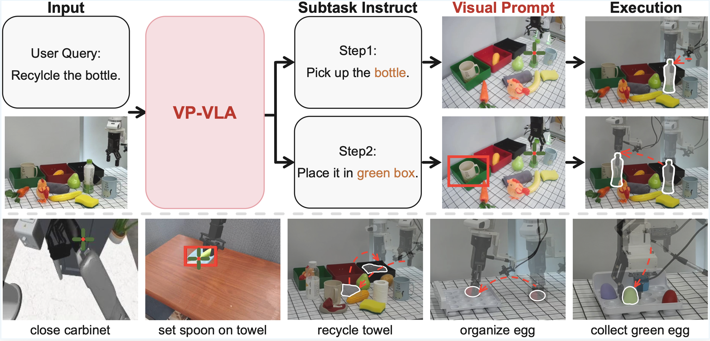
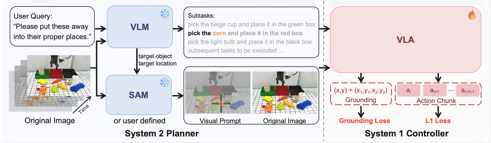

# VP-VLA: Visual Prompting as an Interface for Vision-Language-Action Models

<p align="center">
  <a href="https://visualprompt-vla.github.io/">
    
  </a>&nbsp;&nbsp;&nbsp;&nbsp;
  <a href="https://arxiv.org/abs/2603.22003">
    
  </a>
  <a href="https://huggingface.co/collections/Vincent2311/vp-vla">
    
  </a>
</p>


> Vision-Language-Action (VLA) models often struggle with precise spatial grounding and robustness due to monolithic end-to-end designs. In this project, we introduce that decouples high-level reasoning and low-level execution via a structured visual prompting interface, enabling more precise and reliable robotic manipulation.  

---

<video width="640" controls>
  <source src="assets/VP-VLA_compress.mp4" type="video/mp4">
</video>

## Overview of VP-VLA

<div align=center>

</div>

VP-VLA demonstrates the following features:

1. **Dual-System Architecture**: VP-VLA decomposes robotic manipulation into:
   - **System 2 Planner** (high-level reasoning)
   - **System 1 Controller** (low-level execution)  

2. **Visual Prompt Interface**: Instead of relying solely on text, VP-VLA converts language instructions into **structured visual prompts** (crosshairs and bounding boxes), enabling precise spatial grounding.  

3. **Improved Spatial Precision & Robustness**: By grounding actions in visual space, the framework significantly improves performance in:
   - Novel object scenarios  
   - Out-of-distribution (OOD) spatial configurations  

4. **General Multi-Stage Manipulation**: VP-VLA supports complex, multi-step tasks via:
   - Task decomposition  
   - Event-driven planning  
   - Dynamic visual prompt updates  

---

## News

[Apr 11th, 2026] 🔥 Code released!

[Mar 24th, 2026] 🔥 [📖 Paper](https://arxiv.org/abs/2603.22003) released!

---

## Contents
- [Model](#model)
- [Installation](#installation)
- [Evaluation](#evaluation)
- [Data Preparation](#data-preparation)
- [Training](#training)
- [Citation](#citation)
- [Acknowledgement](#acknowledgement)

---

## Model

<div align=center>

</div>
  

Instead of solving everything in one forward pass, VP-VLA does the following:
- **Language → Visual Prompts → Actions**

This transforms the problem into **visuomotor tracking of explicit spatial cues**, improving precision and interpretability.  

---

## Installation
First, prepare the training environment. We follow the same installation from starVLA:

```bash
git clone https://github.com/JIA-Lab-research/VP-VLA.git
cd VP-VLA
# Create conda environment
conda create -n starVLA python=3.10 -y
conda activate starVLA

# Install requirements
pip install -r requirements.txt

# Install FlashAttention2
pip install flash-attn --no-build-isolation

# Install StarVLA
pip install -e .
```

Next, construct the evaluation environment:
1. Robocasa-Tabletop
Please first follow the [RoboCasa installation](https://github.com/starVLA/starVLA/tree/starVLA_dev/examples/Robocasa_tabletop#-1-environment-setup) guide in ``starVLA`` to install the base robocasa environment.

**Note:** Please install the robosuite package with ``robosuite==1.5.1``. Install it with:

```bash
pip install robosuite==1.5.1
```

2. SimplerEnv
Please first follow the [SimplerEnv installation](https://github.com/starVLA/starVLA/tree/starVLA_dev/examples/SimplerEnv#-1-environment-setup) guide in ``starVLA`` to install the SimplerEnv environment.

3. SAM Environment
Please follow the [SAM3 installation](https://github.com/facebookresearch/sam3?tab=readme-ov-file#installation) guide in ``sam3`` to install the SAM 3 environment. Additionally, install ``transformers`` to support loading the VLM:
``
pip install git+https://github.com/huggingface/transformers
``


### Pre-trained Models
1. Download the base VLM model: [Qwen3-VL-4B-Instruct](https://huggingface.co/Qwen/Qwen3-VL-4B-Instruct) — place it under `./playground/Pretrained_models/Qwen3-VL-4B-Instruct`.

2. Download the SAM 3 checkpoint. Remember to change the default path in ``examples/Robocasa_tabletop/visual_prompt_utility/sam3_server.py``
---

## Evaluation

VP-VLA evaluation requires three concurrent services — a **Policy Server** (the trained VLA model), a **SAM3 Server** (for visual prompt generation), and a **VLM Server** (for task decomposition and subtask detection) — plus the environment-specific evaluation entry point.

### Prerequisites

The evaluation relies on three separate conda environments:

| Environment | Purpose |
|---|---|
| `starVLA` | Policy server |
| `sam3` | SAM3 + VLM servers |
| `simpler_env` (SimplerEnv only) | Simulation environment | 
| `robocasa` (Robocasa only) | Simulation environment |

### SimplerEnv

```bash
cd VP-VLA

# Edit the python paths and SimplerEnv path in the script first
CUDA_VISIBLE_DEVICES=0,1,2,3,4,5,6,7 bash examples/SimplerEnv/eval_files/auto_eval_scripts/run_eval.sh /path/to/checkpoint.pt
```

The script automatically:
1. Launches policy / SAM3 / VLM servers on each GPU
2. Runs all bridge tasks with visual prompting
3. Collects results and saves overlay videos

Modify the following paths at the top of the script:
- `star_vla_python`: path to starVLA conda python
- `sim_python`: path to simpler_env conda python
- `sam3_python`: path to SAM3 conda python
- `SimplerEnv_PATH`: path to the SimplerEnv repository that you cloned

### Robocasa

```bash
cd VP-VLA

# Edit the python paths in the script first
bash examples/Robocasa_tabletop/eval_files/run_eval.sh /path/to/checkpoint.pt 
```

The script automatically:
1. Launches policy / SAM3 / VLM servers (one per GPU)
2. Dispatches 24 tabletop environments across GPUs
3. Monitors for crashes and re-queues failed evaluations (up to 5 retries)

Modify the following paths at the top of the script:
- `starVLA_PYTHON`: path to starVLA conda python
- `ROBOCASA_PYTHON`: path to robocasa conda python
- `SAM3_PYTHON`: path to SAM3 conda python

---

## Data Preparation

VP-VLA requires pre-computed visual prompt data for training. The data preparation pipeline uses VLM (for subtask decomposition and target identification) and SAM3 (for segmentation-based visual prompt generation) to process each episode in the dataset. The below scripts require pre-extract the frames from the dataset. The pre-extracted frames will also be used during training for visual prompt prediction.
 
### Robocasa

```bash
cd VP-VLA

# Edit the paths at the top of the script first (DATASET_ROOT, FRAMES_ROOT, OUTPUT_DIR, SAM_MODEL_PATH, VLM_MODEL_PATH)
bash data_preparation/Robocasa_tabletop/run_parallel_processing.sh [NUM_GPUS] [SAM_SERVERS_PER_GPU] [VLM_SERVERS_PER_GPU] [WORKERS_PER_TASK]
```

The script:
1. Launches multiple SAM3 and VLM servers across GPUs
2. Distributes episode processing across worker processes, each paired with a dedicated SAM+VLM server
3. Outputs `.npz` files containing visual prompt overlays for each episode

Required paths to configure:
- `DATASET_ROOT`: path to the Robocasa dataset (LeRobot format)
- `FRAMES_ROOT`: path to pre-extracted JPEG frames
- `OUTPUT_DIR`: output directory for visual prompt `.npz` files
- `SAM_MODEL_PATH`: path to the SAM3 checkpoint
- `VLM_MODEL_PATH`: path to the Qwen3-VL-4B-Instruct checkpoint

### SimplerEnv (OXE)

```bash
cd VP-VLA

# Edit the paths at the top of the script first (DATASETS_ROOT, OUTPUT_DIR, SAM_MODEL_PATH, VLM_MODEL_PATH)
bash data_preparation/SimplerEnv/run_parallel_processing.sh [NUM_GPUS] [SAM_SERVERS_PER_GPU] [VLM_SERVERS_PER_GPU]
```

The script processes `bridge_orig_lerobot` and `fractal20220817_data_lerobot` datasets with the same parallel SAM+VLM server architecture.

Required paths to configure:
- `DATASETS_ROOT`: path to the OXE datasets directory
- `OUTPUT_DIR`: output directory for visual prompt `.npz` files
- `SAM_MODEL_PATH`: path to the SAM3 checkpoint
- `VLM_MODEL_PATH`: path to the Qwen3-VL-4B-Instruct checkpoint

---

## Training

VP-VLA's System 1 Controller is trained with two concurrent objectives:
1. **VLA action prediction** — predicts continuous robot actions from observations with visual prompt overlays
2. **VP location prediction** — predicts visual prompt coordinates (crosshair center, bounding box) from the overlayed image

### RoboCasa

```bash
cd VP-VLA
bash examples/Robocasa_tabletop/train_files/run_train.sh
```

Before running, modify the following paths in the script:
- `base_vlm`: path to the Qwen3-VL checkpoint
- `data_root_dir`: path to the RoboCasa dataset (LeRobot format)
- `visual_prompt_dir`: path to the pre-computed visual prompt data
- `extracted_frames_dir`: path to the pre-extracted frame images for VP prediction

Config file: [`examples/Robocasa_tabletop/train_files/starvla_cotrain_robocasa_visual_prompt.yaml`](examples/Robocasa_tabletop/train_files/starvla_cotrain_robocasa_visual_prompt.yaml)

### SimplerEnv (OXE)

```bash
cd VP-VLA
bash examples/SimplerEnv/train_files/run_train.sh
```

Before running, modify the following paths in the script:
- `base_vlm`: path to the Qwen3-VL checkpoint
- `data_root_dir`: path to the OXE dataset (LeRobot format)
- `visual_prompt_dir`: path to the pre-computed visual prompt data
- `extracted_frames_dir`: path to the pre-extracted frame images for VP prediction

Config file: [`examples/SimplerEnv/train_files/starvla_cotrain_oxe_visual_prompt.yaml`](examples/SimplerEnv/train_files/starvla_cotrain_oxe_visual_prompt.yaml)

### Key Training Arguments

| Argument | Description |
|---|---|
| `--framework.name` | Model framework (default: `QwenOFT`) |
| `--framework.qwenvl.base_vlm` | Path to base VLM checkpoint |
| `--datasets.vla_data.data_mix` | Dataset mixture name |
| `--datasets.vla_data.feed_both_images true` | Feed both original and overlayed images to the VLA |
| `--trainer.loss_scale.visual_prompt` | Loss weight for VP prediction (default: `0.1`) |
| `--trainer.max_train_steps` | Total training steps |
| `--trainer.learning_rate.base` | Base learning rate |
| `--trainer.learning_rate.qwen_vl_interface` | Learning rate for the Qwen VL interface |

---

## Citation
```bibtex
@article{wang2026vp,
  title={VP-VLA: Visual Prompting as an Interface for Vision-Language-Action Models},
  author={Wang, Zixuan and Chen, Yuxin and Liu, Yuqi and Ye, Jinhui and Chen, Pengguang and Lu, Changsheng and Liu, Shu and Jia, Jiaya},
  journal={arXiv preprint arXiv:2603.22003},
  year={2026}
}
```
## Acknowledgement
We would like to thank the following repos for their great work:
- This work is built upon [starVLA](https://github.com/starVLA/starVLA)
- This work utilizes models from [Qwen3-VL](https://huggingface.co/Qwen/Qwen3-VL-4B-Instruct) and [SAM3](https://huggingface.co/facebook/sam3) 